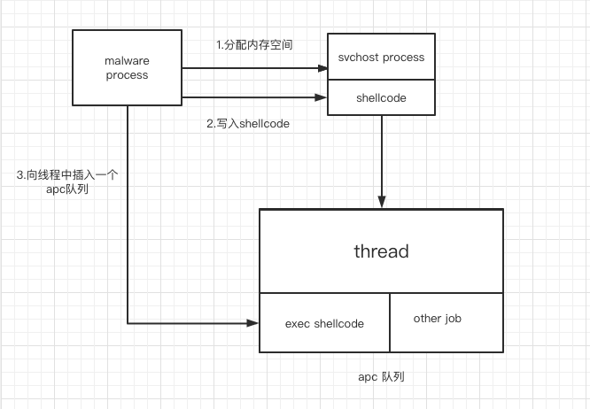
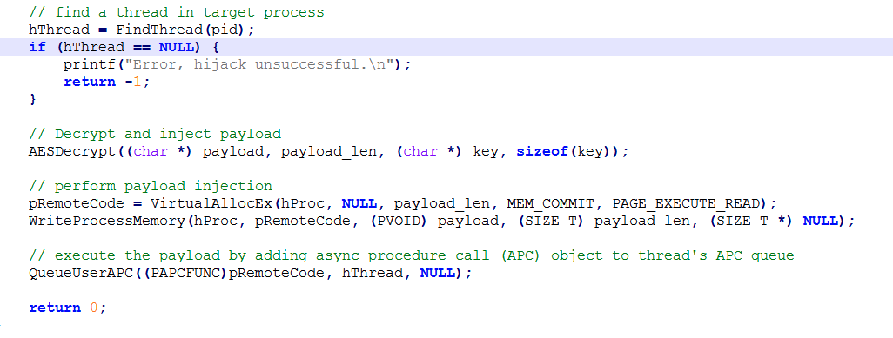
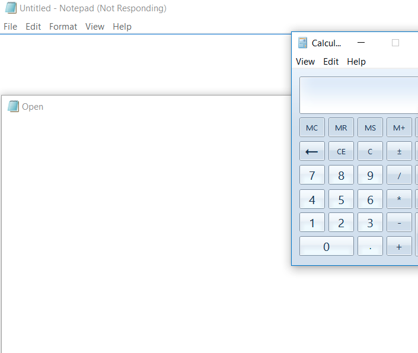
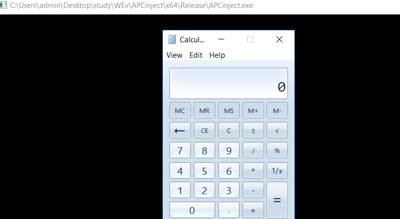

# APC注入概述

 APC（异步过程调用）是在特定线程的上下文中异步执行的函数。 当 APC 排队等候线程时，系统会发出软件中断。 下一次计划线程时，它将运行 APC 函数， 系统生成的 APC 称为 *内核模式 apc*。 由应用程序生成的 APC 称为 *用户模式 apc*。 线程必须处于可报警状态才能运行用户模式 APC。

每个线程都有自己的 APC 队列，如果线程进入可警报状态，它将开始以先进先出（FIFO）的形式执行APC作业。 应用程序通过调用 [**QueueUserAPC**](https://docs.microsoft.com/zh-cn/windows/win32/api/processthreadsapi/nf-processthreadsapi-queueuserapc) 函数将 APC 排队到一个线程。 调用线程指定对 **QueueUserAPC** 的调用中的 APC 函数的地址。 APC 的队列是对线程调用 APC 函数的请求

有关线程和 APC 队列的一些使用方式：

- 线程在进程中执行代码
- 线程可以通过利用 APC 队列异步执行代码
- 每个线程都有一个队列，用于存储所有 APC
- 应用程序可以将 APC 排队到给定线程（受权限限制）
- 调度线程时，将执行排队的 APC
- 这种技术的缺点是恶意程序不能强制受害者线程执行注入的代码 - APC排队到的线程需要进入/进入[可警报]()状态，当线程调用[**SleepEx**](https://docs.microsoft.com/zh-cn/windows/win32/api/synchapi/nf-synchapi-sleepex)、 [**SignalObjectAndWait**](https://docs.microsoft.com/zh-cn/windows/win32/api/synchapi/nf-synchapi-signalobjectandwait)、 [**MsgWaitForMultipleObjectsEx**](https://docs.microsoft.com/zh-cn/windows/desktop/api/Winuser/nf-winuser-msgwaitformultipleobjectsex)、 [**WaitForMultipleObjectsEx**](https://docs.microsoft.com/zh-cn/windows/win32/api/winuser/nf-winuser-msgwaitformultipleobjectsex)或 [**WaitForSingleObjectEx**](https://docs.microsoft.com/zh-cn/windows/win32/api/synchapi/nf-synchapi-waitforsingleobjectex) 函数时，会进入可报警状态。
- 使用 QueueUserAPC 和 NtTestAlert 在本地进程中执行 Shellcode




# 实现思路

总体注入流程：

- 查找要注入的进程的PID
- 在进程内存空间中分配内存
- 在该内存位置中写入shellcode
- 找到该进程中的所有线程，给这些线程插入一个APC，APC指向我们的shellcode

```c++
//这是kernelbase.dll中实现的包装函数，用于将APC插入队列
DWORD 
QueueUserAPC(
    PAPCFUNC pfnAPC,
    HANDLE hThread,
    ULONG_PTR dwData
    );

```


主要代码：



我们将shellcode注入notepad.exe中，当程序进入可警报状态（例如我们点击打开一个文本）将会执行我们的shellcode



# APC注入变种

## Early bird注入

Early Bird是一种简单而强大的技术，Early Bird本质上是一种APC注入与线程劫持的变体，由于线程初始化时会调用ntdll未导出函数**NtTestAlert**，**NtTestAlert**是一个检查当前线程的 APC 队列的函数，如果有任何排队作业，它会清空队列。当线程启动时，**NtTestAlert**会在执行任何操作之前被调用。因此，如果在线程的开始状态下对APC进行操作，就可以完美的执行shellcode。（如果要将shellcode注入本地进程，则可以APC到当前线程并调用**NtTestAlert**函数来执行）

在 Early Bird 中，我们首先创建一个处于挂起状态的进程，然后将 APC 排队到主线程，然后恢复该线程。因此，在线程开始执行主代码之前，它会调用**NtTestAlert**函数来清空当前线程的 APC 队列并运行排队的作业。这种技术被用来bypass AV/EDR hook的过程。因为它试图在AV/EDR有机会将其挂钩放在新创建的进程中之前运行shellcode。


首先利用**CreateProcessA**来创建一个新的进程


成功创建新进程后，需要在目标进程中为我们的shellcode分配内存空间，然后写入shellcode，将我们的APC排到主线程后，恢复线程。


最后我们需要让该线程进入可警报状态，利用[WaitForSingleObjectEx](https://docs.microsoft.com/en-us/windows/win32/api/synchapi/nf-synchapi-waitforsingleobjectex)、 [SleepEx](https://docs.microsoft.com/en-us/windows/win32/api/synchapi/nf-synchapi-sleepex)等函数来执行

```c++
WaitForSingleObjectEx(hThread, INFINITE);
```


### NtTestAlert 执行

Early bird本质上是线程初始化是调用了NtTestAlert函数清空APC队列导致的代码执行，那么我们可以直接通过调用这个函数来进行命令执行。

首先为shellcode分配内存空间，然后写入shellcode，将APC排到当前线程，然后调用NtTestAlert()就可以执行我们的shellcode。




和early bird那种方式的区别在于不用新创建一个进程来进行注入，并且避免了暂停和恢复进程操作，可以减少被EDR检测的风险。


## Special User APC

内核向APC 公开了 3 个系统调用：NtQueueApcThread、NtQueueApcThreadEx 和 NtQueueApcThreadEx2。QueueUserAPC 是 kernelbase.dll 中的一个封装函数，它调用 NtQueueApcThread。

有 2 种类型的用户模式 APC：

1. 用户 APC：正常类型的用户 APC，仅在线程可发出警报时运行
2. 特殊用户APC：RS5中添加的一种相对较新的APC类型。

特殊用户APC是自Windows的RS5发布以来添加的新系统调用，可以通过使用**NtQueueApcThreadEx**功能来实现。通常，线程只有在进入可警报状态时才能运行 APC。但是使用特殊用户APC，我们可以强制线程运行APC，而不会进入可警报状态。

```c++
NTSTATUS
NtQueueApcThread(  
    IN HANDLE ThreadHandle,
    IN PPS_APC_ROUTINE ApcRoutine,//指在目标进程中routine的地址，也就是函数地址。
    IN PVOID SystemArgument1 OPTIONAL,
    IN PVOID SystemArgument2 OPTIONAL,
    IN PVOID SystemArgument3 OPTIONAL
    );
//从win7开始新增加的系统调用，这个系统调用与NtQueueApcThread相同，但允许指定一个MemoryReserveHandle
NTSTATUS
NtQueueApcThreadEx(  
    IN HANDLE ThreadHandle,
    IN HANDLE MemoryReserveHandle,
    IN PPS_APC_ROUTINE ApcRoutine,
    IN PVOID SystemArgument1 OPTIONAL,
    IN PVOID SystemArgument2 OPTIONAL,
    IN PVOID SystemArgument3 OPTIONAL
    );

//RS5修改后的，和win7的差不多，但是MemoryReserveHandle被修改成UserApcOption
NTSTATUS
NtQueueApcThreadEx(
	IN HANDLE ThreadHandle,
	IN USER_APC_OPTION UserApcOption,
	IN PPS_APC_ROUTINE ApcRoutine,
	IN PVOID SystemArgument1 OPTIONAL,
	IN PVOID SystemArgument2 OPTIONAL,
	IN PVOID SystemArgument3 OPTIONAL
	);
```

利用特殊用户APC进行APC注入的所有步骤都类似于简单的APC注入，我们使用**NtQueueApcThreadEx**函数将一个特殊的 APC 排队到属于我们目标进程的第一个线程。

```c++
USER_APC_OPTION UserApcOption;
UserApcOption.UserApcFlags = QueueUserApcFlagsSpecialUserApc;
for (Thread32First(snapshot, &te); Thread32Next(snapshot, &te);) {
	if (te.th32OwnerProcessID == target_process_id) {
		HANDLE target_thread_handle = OpenThread(THREAD_ALL_ACCESS, NULL, te.th32ThreadID);
		NtQueueApcThreadEx(target_thread_handle, QueueUserApcFlagsSpecialUserApc, (PKNORMAL_ROUTINE)target_process_buffer, NULL, NULL, NULL);
		CloseHandle(target_thread_handle);
		break;
	}
}
```

