# 概述

module stomp是一种shellcode注入技术（也有人叫他module overload或者dll hollowing），他的工作原理如下：

1. 创建一个进程或打开一个现有进程的句柄
2. 让该进程从磁盘上加载一个系统的DLL
3. 在DLL的内存空间中覆盖写入shellcode
4. 利用createthread或者其他方式去执行内存中的shellcode

当选择一个要加载的DLL时，需要考虑的是它的大小。我们不能加载一个比我们的shellcode小的DLL，这会导致你可能会覆盖进程内存中的一个相邻DLL。

# 实现思路

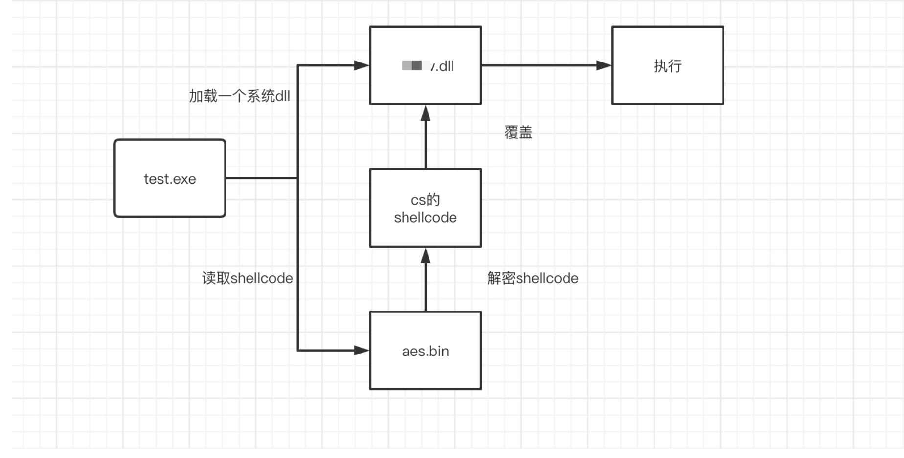

采用shellcode和加载器分离的方式来进行设计，同时对shellcode进行加密**(加密的算法不重要，重要的是一定要加密)**

## 具体实现

采用AES加密的方式对shellcode进行加密，这里可以采用python来进行生成。

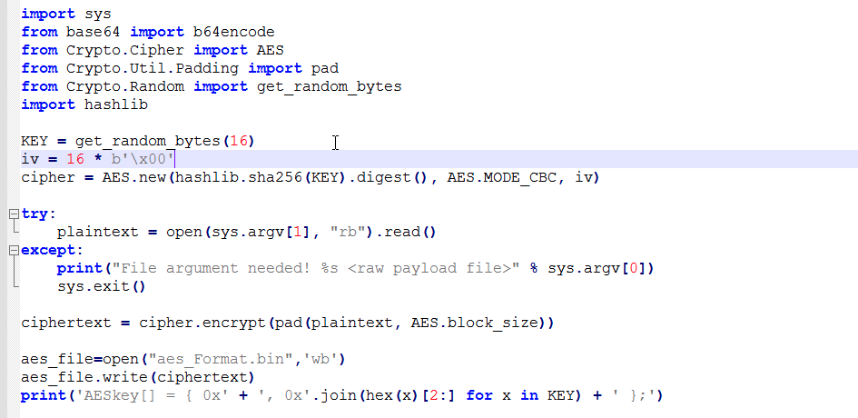

我们将生成的key替换到我们的c++文件中，并且在代码中写入解密函数。

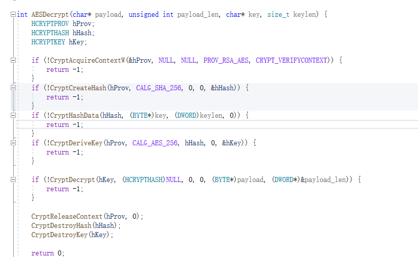

采用动态加载的方式来获取我们的需要的函数，直接加载的方式是直接调用需要的函数，最终编译的文件中所有需要的函数会在其导入表，运行时也就需要导入表找到对应函数的地址。因此导入表会暴露许多信息，而许多杀软就会针对导入表进行检测。

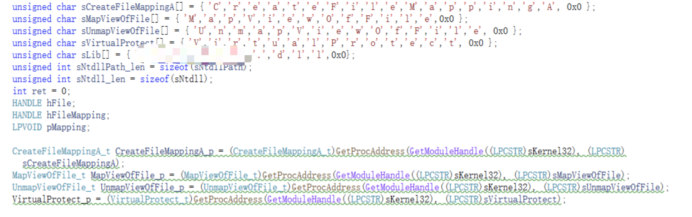

同时为了避免调用ntdll中的函数被拦截，需要进行一个脱钩操作。我们需要用原始字节去覆盖被改过的字节，首先打开ntdll，并且获取文件映射

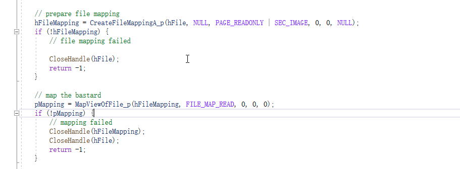

编写一个unhookNtdll函数，将我们新加载的ntdll中的.TEXT段替换到被hook住的ntdll上。

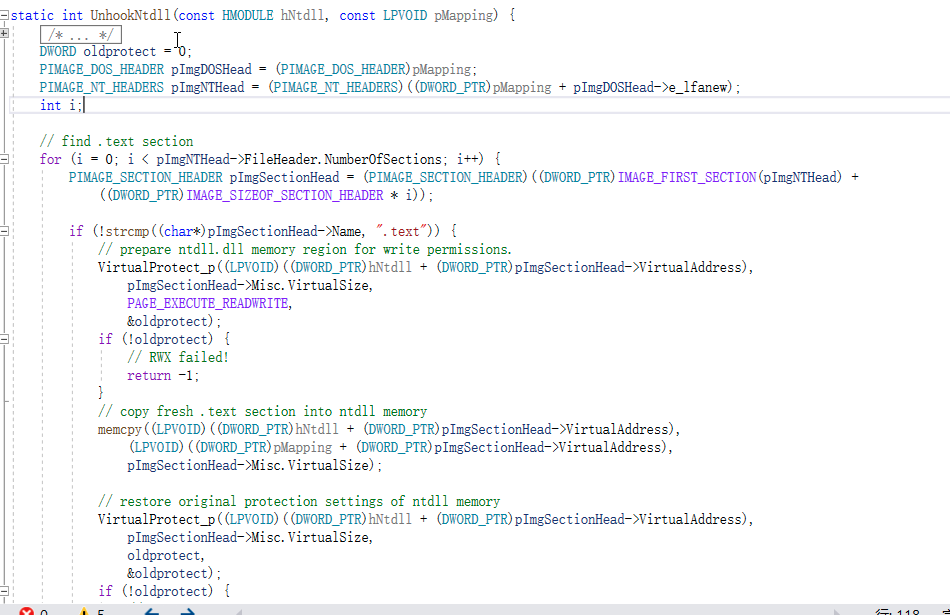

接下来就是读取shellcode的过程，并且加载一个我们不需要的系统DLL。

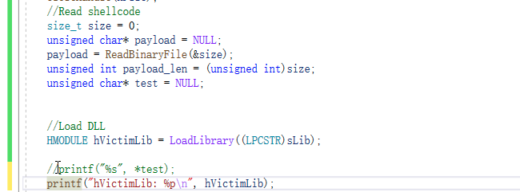

当DLL加载过后，设置一个payload的起始地址，利用virtualprotect来修改权限，并且利用RtlMoveMemory将解密后的shellcode覆盖写入内存，然后再去执行。

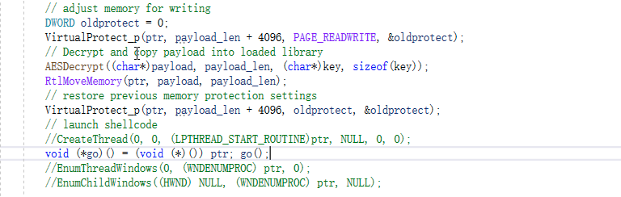

# 实际操作

执行时查看起始地址

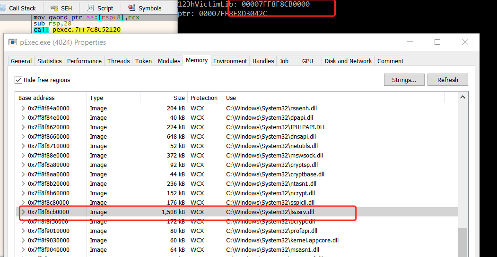

查看插入前原始内容

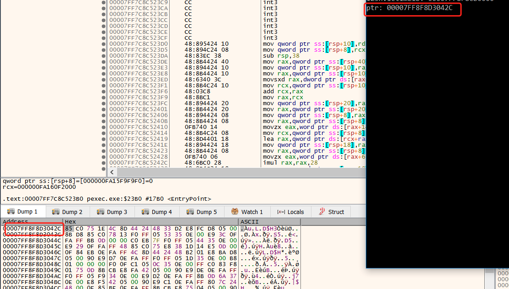

修改后的内容

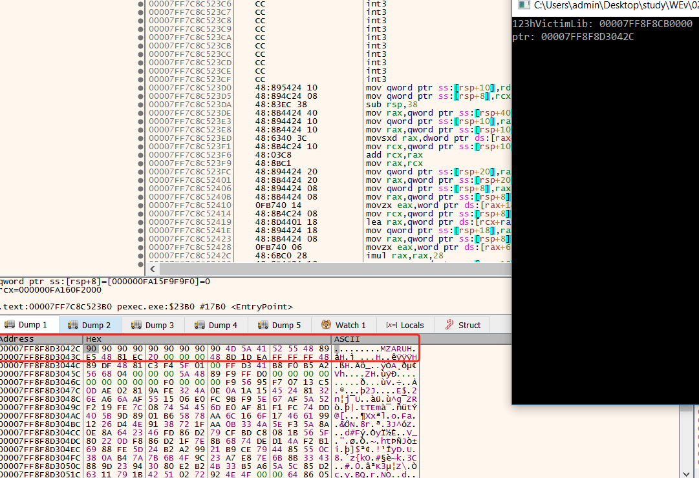

可以通过这种方式来绕过360的核晶模式，并成功上线。

