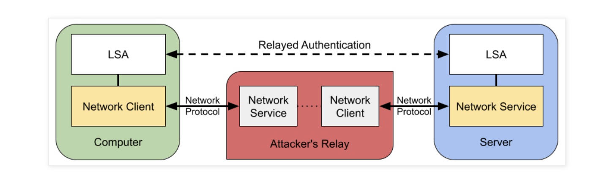
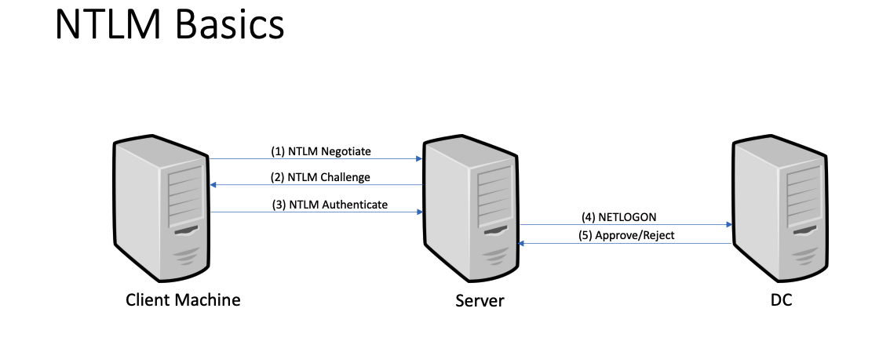
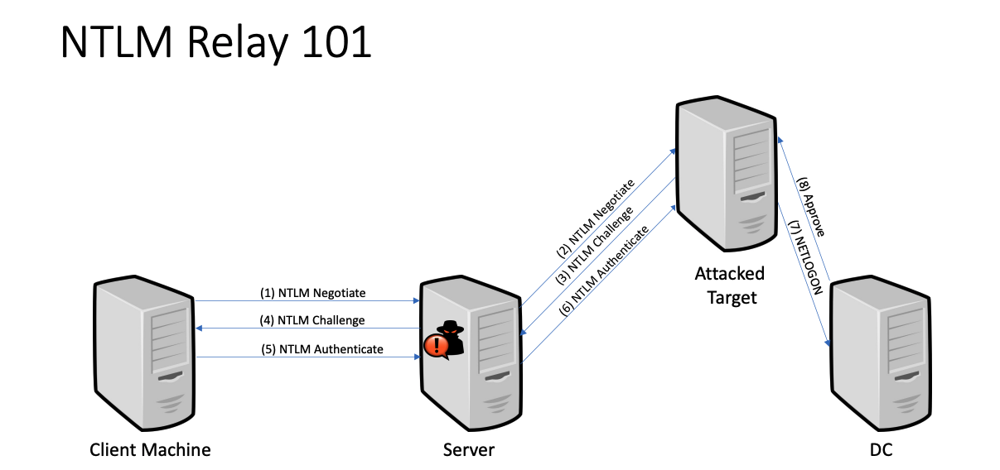
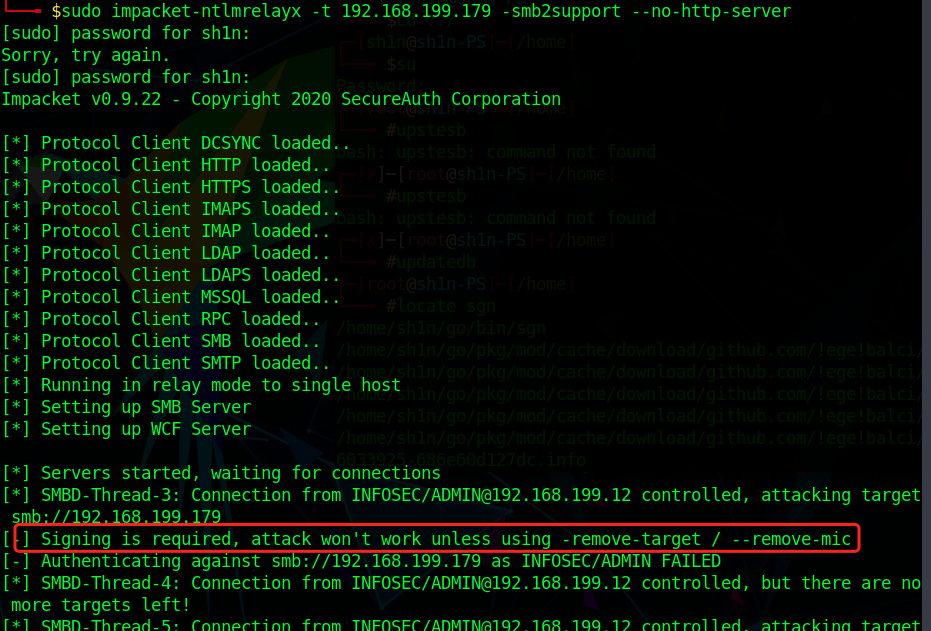
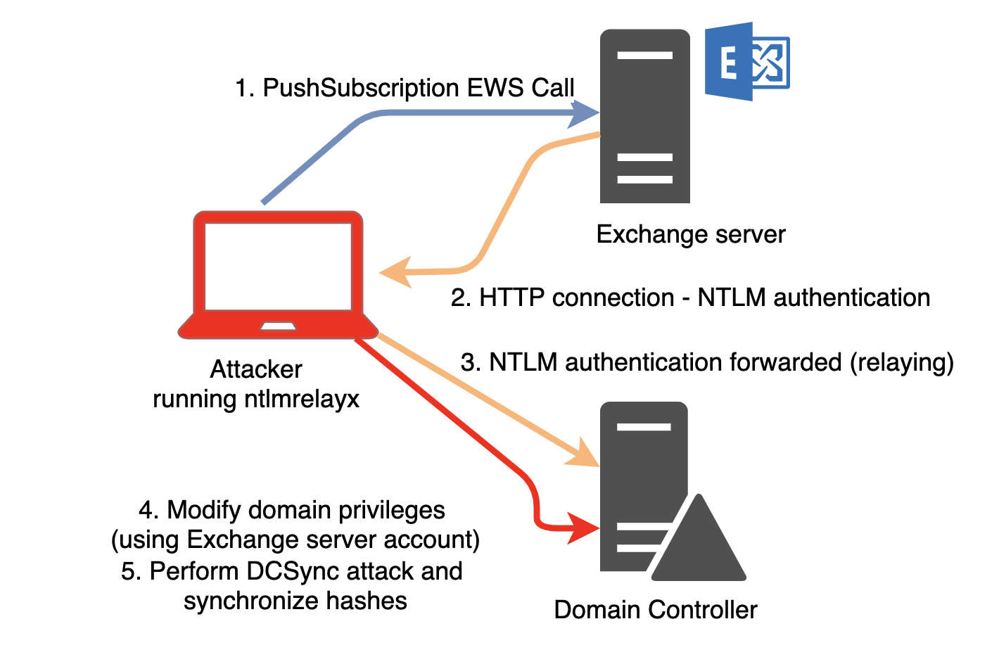
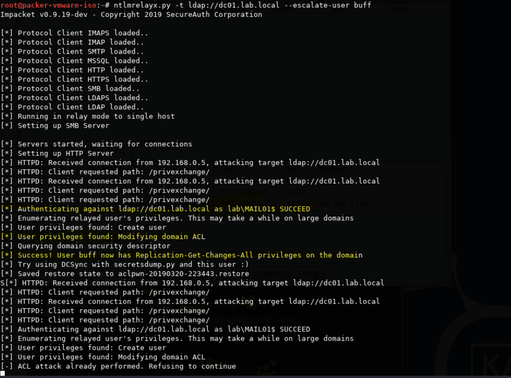
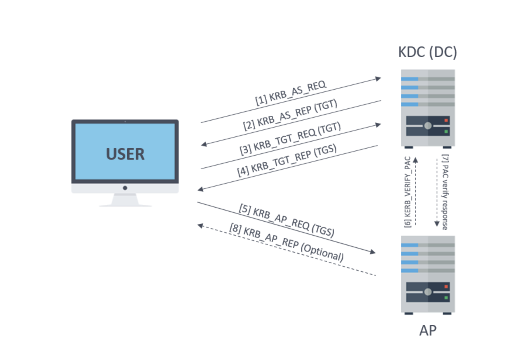

# NTLM和Kerberos


## 概述

基于 Windows 的企业网络依赖于网络身份验证协议，如NTLM 和 Kerberos 来实现单一登录。这些协议允许域用户不用重复输入其密码连接到公司资源。这由计算机的*本地安全机构 （LSA）* 进程工作，该进程会在用户首次进行身份验证时存储用户的凭据，然后，LSA 可以重复使用这些凭据进行网络身份验证，而无需用户交互。

但是，在执行网络身份验证时不提示用户输入其凭据的便利性有一个缺点。为了最有用，网络协议（如 HTTP 或 SMB）的常见客户端必须在没有用户交互的情况下自动执行身份验证，否则会破坏避免向用户询问其凭据的目的。

如果攻击者可以诱使用户连接到他们控制的服务器，则此自动身份验证可能会成为问题。攻击者可能诱使用户的网络客户端启动身份验证过程，并使用该信息向不相关的服务进行身份验证，从而允许攻击者以用户身份访问该服务的资源。当以这种方式捕获身份验证协议并将其转发到另一个系统时，它被称为身份验证中继攻击。



微软利用组策略禁用特定服务或网络范围内的 NTLM 身份验证作为解决方式，将身份认证限制为kerberos。

## WINDOWS SSP

安全支持提供程序 （SSP） 是 Windows 用于执行 Windows 登录身份验证的 API。它是为其他应用程序提供安全包的DLL文件。当系统启动时，此 DLL 会在 LSA 中堆叠起来;使其成为一个启动过程。在 LSA 中加载后，它可以访问窗口的所有凭据。Windows中有不同的SSP ，它们以DLL的形式实现了SSPI，可以被不同的应用程序使用。以下是一些SSP：

​	Kerberos SSP (kerbero.dll)负责管理Kerberos身份验证。它还负责缓存Kerberos票据和密钥。

​	NTLMSSP (msv1_1.dll)管理NTLM认证。它负责缓存NT哈希值，这些哈希值可以通过模拟lsass进程提取出来。

​	Negotiate SSP (secur32.dll)是一个中介SSP，负责管理SPNEGO协商，并根据协商结果将认证委托给Kerberos SSP或NTLM SSP。

​	Digest SSP 在Windows 2008 R2默认禁用密码缓存，但是可以通过将HKLM\SYSTEM\CurrentControlSet\Control\SecurityProviders\WDigest\UseLogonC中注册表项设置为1或直接在内存中修改DIgest SSP来启用密码缓存

​	CredSSP (CredSSP.dll)创建一个TLS通道，通过对客户端进行身份验证，最后允许客户端向服务器发送用户完整的凭证，在RDP中被使用。

## NTLM中继攻击

NTLM身份验证过程由NTLM SSP处理，独立于使用它的应用协议。另外，必须注意，为了证明其身份，客户机必须有一个密钥。在NTLM身份验证中使用的密钥是作为客户端的用户的NT哈希(在NTLMv1中也使用LM哈希)

***\*MIC\****

为了保护NTLM的完整性，认证消息中包括了一个MIC，MIC是通过使用会话密钥对NTLM进程的所有消息应用进行计算生成的一个值。

NTLM 中继攻击由一个执行Person-in-The-Middle的攻击组成，该攻击利用其中间位置将NTLM认证重定向到目标服务器，从而获得一个经过认证的会话。

因此，在使用NTLMv1的情况下，执行NTLM Relay攻击的攻击者只需要删除AUTHENTICATE消息的MIC(并调整Drop the MIC中所示的标志)就可以篡改数据，例如，禁用应用程序消息的签名。



NTLM中继攻击的缺陷在于即使攻击者通过了身份验证，它也不知道在传输过程中加密的会话密钥。因此，如果在客户端和服务器之间协商签名，攻击者将无法为应用程序消息生成有效的签名，从而无法与服务器对话，因此攻击失败。然而，即使客户端和服务器想要协商签名，攻击者也可以篡改消息以取消该标志的设置。为了避免这种情况，AUTHENTICATE消息包含一个MIC的签名。服务器会检查MIC，如果和原始消息的签名不同会停止连接。



在CVE-2015-005之前，在使用NTLM域账户的情况下，攻击者可以使用Netlogon调用(NetrLogonSamLogonWithFlags)要求DC验证AUTHENTICATE消息和返回的会话密钥，所以攻击者可以利用这个绕过签名限制。

一般来说有四种类型的NTLM中继，分别是：

从SMB到LDAP的跨协议NTLM中继，从LDAP到SMB的NTLM的跨协议中继，SMB协议自身的NTLM中继，利用HTTP进行的LDAP或SMB的跨协议中继。

我们可以利用responder来设置监听服务器

```shell
impacket-ntlmrelayx -t target_ip -smb2support --no-http-server
```

这里出现了一个签名问题，在SMB1和SMB2中，默认情况下客户端启用了签名(但不是必需的)，因此设置了NTLM标志NTLMSSP_NEGOTIATE_SIGN。默认情况下，DC和Exchange等服务器都需要签名。



#### privExchange

我们可以利用HTTP来进行中继攻击，利用privExchange漏洞来进行攻击，通过 HTTP 使用 NTLM 向攻击者进行身份验证的方法。

漏洞利用条件：

- 默认情况下，Exchange 服务器具有高权限
- NTLM 身份验证容易受到中继攻击
- Exchange 具有一项功能使用 Exchange 服务器的计算机帐户向攻击者进行身份验证

Exchange的计算机用户是一个高权限账户，可以修改AD中的ACL属性，因此，我们将NTLM中继到LDAP上时，我们就可以修改AD中的对象，并赋予一定的权限（包括Dcsync的权限）。我们通过让Exchange服务器利用HTTP向任意URL进行身份验证的行为，可以达到该漏洞的目的。




利用过程

```shell
//指定目标DC，以及我们要修改的用户
impacket-ntlmrelayx -t ldap://dc01.lab.local --escalate-user buff

//利用Privechange进行请求
python privexchange.py -ah 192.168.0.142 mail01.lab.local -d lab.local -u chry -p Welcome1
```

邮件服务器发送一个HTTP请求到我们的中继服务器，利用中继服务器去进行身份验证并获取到NTLMv2的hash，我们通过 LDAP 将其中继到域控制器，修改用户的 ACL 权限以获取 DCsync 权限。



## kerberos

#### 概述

Kerberos是Active Directory网络中域帐户的首选身份验证协议，并且该协议不能在工作组中使用，他是由Kerberos SSP来实现的

kerberos协议中的关键是”ticket“的token使用，该token允许用户根据服务主体来进行身份验证，最常见的Kerberos主体是服务和用户。

要请求服务的票证，必须指定它的SPN，例如：HOST/computer，有几种Kerberos主体类型可用于请求服务：NT-SRV-INST、NT-SRV-HST或NT-SRV-XHST。另一方面，也可以利用用户来表示主体，实际上他们主要用于请求票据所使用的计算机名称，用户名通常是由SamAccountName来指定，类型为NT-PRINCIPAL。还有一种NT-ENTERPRISE类型，他使用更加明确的格式来标识用户，例如SamAccountName@DomainFQDN（test@infose.com），当不同的域来请求是，他可以用来识别来自不同域的用户。

#### 票据

票据是部分加密的结构，包含：

* 票据应用的目标主体(通常是一个服务)

* 与客户端相关的信息，如名称、域等

* 用于在客户端和服务之间建立安全通道的密钥

* 用来确定票证有效期间的时间戳

```c++
Ticket          ::= [APPLICATION 1] SEQUENCE {
        tkt-vno         [0] INTEGER (5),
        realm           [1] Realm,
        sname           [2] PrincipalName, //Usually the service SPN
        enc-part        [3] EncryptedData //EncTicketPart
}

EncTicketPart   ::= [APPLICATION 3] SEQUENCE {
        flags                   [0] TicketFlags,
        key                     [1] EncryptionKey, // Session Key
        crealm                  [2] Realm,
        cname                   [3] PrincipalName,
        transited               [4] TransitedEncoding,
        authtime                [5] KerberosTime,
        starttime               [6] KerberosTime OPTIONAL,
        endtime                 [7] KerberosTime,
        renew-till              [8] KerberosTime OPTIONAL,
        caddr                   [9] HostAddresses OPTIONAL,
        authorization-data      [10] AuthorizationData OPTIONAL // Includes a PAC
}
```

#### PAC

除了常规票据，Kerberos的Active Directory实现通常在authorization-data票据字段中包含一个Active Directory身份验证中的重要结构：PAC。

PAC(特权属性证书)包含与客户端相关的安全信息：

* 客户端域：包括域名和SID (分别是LogonDomainName和LogonDomainId)。

* 客户端用户：用户名和用户RID(分别是EffectiveName和UserId)。

* 客户端组：用户所属的域组的RID (GroupId)。

* 其他组：PAC包括引用非域组的其他SID (ExtraSid)，可以应用于域间身份验证，以及用于指示特殊特征的WellKnown SID。

除了用户信息，PAC还包括几个用于验证PAC和票据数据的完整性的签名。

* 服务器签名：PAC内容的签名，使用与票据加密相同的密钥创建。

* KDC签名：使用KDC密钥创建的服务器签名的签名。这可以用来检查PAC是由KDC创建的，并防止Silver ticket攻击，但不进行检查。

* 票证签名：用KDC密钥创建的票证内容的签名。该签名最近才被引入，以防止Bronze bit攻击。


在认证中存在一个KDC（密钥分发中心）来给用户提供票据，一般来说KDC就是域控，因为他可以访问域数据库（NTDS），从而对用户进行一个身份验证。在kerberos中存在两种类型的票据，一个叫TGT，一个叫ST

#### ST

ST是指服务票据，是客户端提供给AP（application server）/服务/主体以获得对它的访问权，KDC回应请求并发处ST。ST有时候被称为TGS。而在rfc4120中，TGS是指提供服务票据的服务。我认为ST被称为TGS可能是由于对票据授予服务一词的误解，人们可能会认为它指的是授予服务的票据，但它实际上指的是授予票据的服务。无论如何，如果其他文章在谈论TGS，它可能指的是用于访问服务的票据。

在AD中，客户端可以获得在域数据库中注册的任何服务的ST，即使用户不能访问的服务(Kerberos不处理)或没有运行的服务也可以。

ST应该由目标主体/服务读取，因为它们包含关于需要进行身份验证的客户机的信息以及用于与客户机建立连接的会话密钥。所以ST使用目标主体的密钥进行加密。

* 如果我们知道目标主体的密钥，那么我们可以为该主体伪造票据。就Active Directory而言，如果我们知道用户的密钥，我们就可以定制访问该用户的任何服务的票据。这些定制票被称为Silver ticket。

* 如果知道计算机帐户的密码(存储在计算机的LSA Secrets中)，那么可以为该计算机的SMB服务创建Silver票据，并像管理员一样访问该计算机。
* 如果几个服务属于同一个用户，它们将使用相同的密钥进行加密，例如，如果能够为machineA中的MSSQL数据库获取一个管理员的ST(SPN = MSSQLSvc\machineA)，可以修改服务以指向同一台机器的SMB服务(SPN = CIFS\machineA)并且获得使用machineA的权限。

#### TGT

为了从KDC获得一个ST，用户需要提供另一种类型的票据，TGT(票据授予票据)。TGT类似于KDC的ST。

实际上，按照只允许目标主体访问票据的原则，所有的TGT都使用域的krbtgt帐户的密钥(称为KDC密钥)进行加密。因此，如果可以检索krbtgt的值(存储在NTDS中)，那么就可以创建黄金票据（Golden tickets）。我们可以通过krbtgt的hash值来模拟任何域中用户包括管理员。通过在PAC中设置特殊的特权SID(如Enterprise Admins)，Golden tickets甚至可以用来破坏整个森林。

PAC中包含对用户和相关的安全数据，如果信息是正确的就不会进行验证 (不正确则会存在20分钟)，因此，可以将任何用户添加到票据的任何组，甚至创建域内不存在的用户的票据。

kerberos工作原理：



DC通过88/TCP和88/UDP端口来监听Kerberos，除了KDC之外，Kerberos还有另一个服务kpasswd，它允许更改域中用户的密码，使用的端口是464/TCP和464/UDP。
